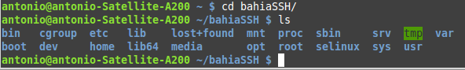
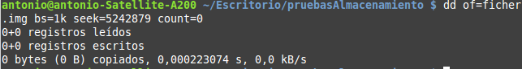
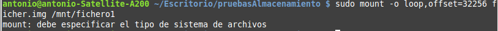

###Ejercicio 1)

**1.- ¿Cómo tienes instalado tu disco duro? ¿Usas particiones? ¿Volúmenes lógicos?**

Mi disco duro está dividido en 7 particiones:
- Recuperación para devolverlo al estado de fábrica.
- Recuperación de Windows 8
- Datos de Windows 8
- Directorio home de Linux
- Directorio raíz de Linux
- Partición para intercambio (SWAP).

Siendo estas tres últimas particiones lógicas dentro de otra que engloba a todo el sistema Linux.


**2.- Si tienes acceso en tu escuela o facultad a un ordenador común para las prácticas, ¿qué almacenamiento físico utiliza?**

**3.- Buscar ofertas SAN comerciales y comparar su precio con ofertas locales (en el propio ordenador) equivalentes.**

Buscando, he encontrado la web de la compaía Aberdeen, cuyo [SAN iSCSI más barto](https://iceberg.aberdeeninc.com/AberSys/AberSysCon.aspx?Nire=conpag&Tikya=scDAS-iSD11m) cuesta 8321$, siempre teniendo en cuenta que son las [especificaiones por defecto](http://www.aberdeeninc.com/abcatg/xdas-iscsi-1u-d.htm).

###Ejercicio 2)

He instalado una máquina virtual con el SO Slitaz 4.0, a la cual voy a acceder mediante sshfs, para ello se ejecutan las siguienes órdenes (me he ayudado de [éste](http://tuxpepino.wordpress.com/2007/05/14/%C2%BFconocias-sshfs/#more-141) tutorial):

```sh
sudo apt-get install sshfs
sudo nano /etc/modules -> agregar fuse al final del archivo si no está
sudo modprobe fuse -> para iniciarlo sin tener que reiniciar
sudo usermod -G fuse -a antonio
[REINICIAR INTERFAZ GRÁFICA PARA APLICAR LOS CAMBIOS]
mkdir /home/antonio/bahiaSSH
sshfs <user>@bahia.ugr.es:/ /home/antonio/bahiaSSH/
```
Y ya podemos acceder al contenido del disco remoto:



###Ejercicio 3)

## Archivo raw

En primer lugar se crea el archivo:



Si se intenta montar se obtiene el error por no estar formateado:




