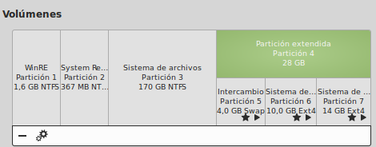

###Ejercicio 1)

**1.- ¿Cómo tienes instalado tu disco duro? ¿Usas particiones? ¿Volúmenes lógicos?**

Mi disco duro está dividido en 7 particiones:
- Recuperación para devolverlo al estado de fábrica.
- Recuperación de Windows 8
- Datos de Windows 8
- Directorio home de Linux
- Directorio raíz de Linux
- Partición para intercambio (SWAP).

Siendo estas tres últimas particiones lógicas dentro de otra que engloba a todo el sistema Linux.

**2.- Si tienes acceso en tu escuela o facultad a un ordenador común para las prácticas, ¿qué almacenamiento físico utiliza?**

**3.- Buscar ofertas SAN comerciales y comparar su precio con ofertas locales (en el propio ordenador) equivalentes.**