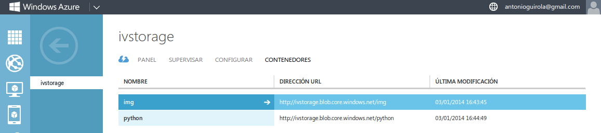

### Ejercicio 1)

**1.- ¿Cómo tienes instalado tu disco duro? ¿Usas particiones? ¿Volúmenes lógicos?**

Mi disco duro está dividido en 7 particiones:
- Recuperación para devolverlo al estado de fábrica.
- Recuperación de Windows 8
- Datos de Windows 8
- Directorio home de Linux
- Directorio raíz de Linux
- Partición para intercambio (SWAP).

Siendo estas tres últimas particiones lógicas dentro de otra que engloba a todo el sistema Linux.


**2.- Si tienes acceso en tu escuela o facultad a un ordenador común para las prácticas, ¿qué almacenamiento físico utiliza?**

**3.- Buscar ofertas SAN comerciales y comparar su precio con ofertas locales (en el propio ordenador) equivalentes.**

Buscando, he encontrado la web de la compaía Aberdeen, cuyo [SAN iSCSI más barto](https://iceberg.aberdeeninc.com/AberSys/AberSysCon.aspx?Nire=conpag&Tikya=scDAS-iSD11m) cuesta 8321$, siempre teniendo en cuenta que son las [especificaiones por defecto](http://www.aberdeeninc.com/abcatg/xdas-iscsi-1u-d.htm).

### Ejercicio 2)

He instalado una máquina virtual con el SO Slitaz 4.0, a la cual voy a acceder mediante sshfs, para ello se ejecutan las siguienes órdenes (me he ayudado de [éste](http://tuxpepino.wordpress.com/2007/05/14/%C2%BFconocias-sshfs/#more-141) tutorial):

```sh
sudo apt-get install sshfs
sudo nano /etc/modules -> agregar fuse al final del archivo si no está
sudo modprobe fuse -> para iniciarlo sin tener que reiniciar
sudo usermod -G fuse -a antonio
[REINICIAR INTERFAZ GRÁFICA PARA APLICAR LOS CAMBIOS]
mkdir /home/antonio/bahiaSSH
sshfs <user>@bahia.ugr.es:/ /home/antonio/bahiaSSH/
```
Y ya podemos acceder al contenido del disco remoto:


### Ejercicio 3)

#### Archivo raw

En primer lugar se crea el archivo:


Si se intenta montar se obtiene el error por no estar formateado:


#### Archivo qcow

En este caso he creado un archivo de 5MB con la orden `qemu-img create -f qcow2 cowFile.qcow2 5M`:


### Ejercicio 4)

Los pasos a seguir son:

#### Crear las imágenes

```sh
sudo qemu-img create -f raw xfsImg.img 200M
sudo qemu-img create -f raw btrfsImg.img 200M
```

#### Convertirlas en dispositivos *loop*

```sh
sudo losetup -v -f xfsImg.img
sudo losetup -v -f btrfsImg.img
```

#### Formatear las unidades

```sh
sudo mkfs.xfs /dev/loop0
sudo mkfs.btrfs /dev/loop1
```


#### Crear directorios y montar las unidades

```sh
sudo mkdir /mnt/xfs
sudo mkdir /mnt/btrsf

sudo mount /dev/loop0 /mnt/xfs/
sudo mount /dev/loop1 /mnt/btrfs/
```

Comprobamos que todo sea correcto con la orden `df -h`:


#### Crear el archivo que se va a transmitir y el script para medir los tiempos

En mi caso he utilizado fallocate para crear un archivo de 40MB: `fallocate -l 40M ficheroPruebas`.

Utilizando el lenguaje Python he creado un script que acepta 3 argumentos: un archivo a copiar y dos directorios; de forma que se realicen las pruebas necesarias para este ejercicio:

```sh
#!/usr/bin/python

import time
import sys
import os

# Comprobar el numero de argumentos:
if len(sys.argv)!=4:
	print(u'Error. Uso: archivo_a_copiar ruta_dir_xfs ruta_dir_btrfs')
	sys.exit()

archivo=sys.argv[1]
ruta_dir_xfs=sys.argv[2]
ruta_dir_btrfs=sys.argv[3]

# Copiar de sistema local (ext4) a xfs y btrfs
start = time.time()
os.system("cp "+archivo+" "+ruta_dir_xfs+"/archivo")
end = time.time()
t = end - start
print('Copiar de ext4 a xfs: '+str(t)+' s')

start = time.time()
os.system("cp "+archivo+" "+ruta_dir_btrfs+"/archivo")
end = time.time()
t = end - start
print('Copiar de ext4 a btrfs: '+str(t)+' s')

# Copiar xfs a si mismo
start = time.time()
os.system("cp "+ruta_dir_xfs+"/archivo "+ruta_dir_xfs+"/copia")
end = time.time()
t = end - start
print('Copiar de xfs a xfs: '+str(t)+' s')

# Copiar btrfs a si mismo
start = time.time()
os.system("cp "+ruta_dir_btrfs+"/archivo "+ruta_dir_btrfs+"/copia")
end = time.time()
t = end - start
print('Copiar de btrfs a btrfs: '+str(t)+' s')

# Copiar xfs a btrfs
start = time.time()
os.system("cp "+ruta_dir_xfs+"/archivo "+ruta_dir_btrfs+"/copia_desde_xfs")
end = time.time()
t = end - start
print('Copiar de xfs a btrfs: '+str(t)+' s')

# Copiar btrfs a xfs
start = time.time()
os.system("cp "+ruta_dir_btrfs+"/archivo "+ruta_dir_xfs+"/copia_desde_btrfs")
end = time.time()
t = end - start
print('Copiar de btrfs a xfs: '+str(t)+' s')
```

El resultado es el siguiente:


### Ejercicio 8)

El primer paso es entrar en windowsazurepass.com/azureu y solicitar la cuenta de prueba, rellenar el formulario y esperar el email de confirmación, que suele tardar de 2 a 3 días laborables pero a mi me llegó el email de confirmación a los 10 minutos.


A continuación, para instalar la herramienta de línea de órdenes necesito los paquetes nodejs y npm, a continuación hay que seguir las instrucciones del enlace del enunciado:

```sh
sudo apt-get install npm

sudo add-apt-repository ppa:chris-lea/node.js
sudo apt-get update
sudo apt-get install nodejs

git clone https://github.com/WindowsAzure/azure-sdk-tools-xplat.git
cd ./azure-sdk-tools-xplat
sudo npm install 
sudo npm install -g azure-cli
```


Una vez instalado, pasamos a configurar la cuenta, para ello hay que ejecutar `azure account download
`, descargar el archivo de la URL que aparece y a continuación `azure account import Azpad246CWO9665-1-3-2014-credentials.publishsettings`.


### Ejercicio 9)

Creamos una cuenta de almacenacmiento (he seleccionado la opción 7, Europa Occidental) y mostramos las claves:

```sh
azure account storage create ivstorage
azure account storage keys list ivstorage
```

A continuación establecemos los valores recibidos en las variables de entorno:

```sh
export AZURE_STORAGE_ACCOUNT=ivstorage
export AZURE_STORAGE_ACCESS_KEY=xxxxxxxxxxxxxxxxxxxxxxxxxxxxxxxxxxxx==
```
Y para que no haya que introducir la información cada vez que se inicie sesión se guardan los cambios en el archivo ~/.profile:


Lo siguiente es crear los contenedores, he creado uno para imágenes y otro para almacenar ficheros Python, ambos de acceso público:

```sh
azure storage container create img -p blob
azure storage container create python -p blob
```



He subido la captura anterior al almacenamiento de Azure mediante `azure storage blob upload ej9-3.png img capturaEj9.png`.


Una vez finalizado el proceso se puede acceder a la imagen mediante la URL http://ivstorage.blob.core.windows.net/img/capturaEj9.png

### Ejercicio 10)

Para llevar la contraria yo voy a utilizar un script Python que realice esta meta-tarea, me he ayudado de [éste tutorial](http://www.windowsazure.com/en-us/develop/python/how-to-guides/blob-service/?fb=es-es).

Es necesario instalar el paquete de Azure para Python:


El script es el siguiente (sin la clave):

```sh
# -*- coding: utf-8 -*- 

from azure.storage import *

#Establecemos conexión:
blob_service = BlobService(account_name='ivstorage', account_key='xxxxxxxxxxxxxxxxxxxxxxxxxxxxxxx==')

#Creamos un nuevo contenedor público:
blob_service.create_container('contenedorejdiez',x_ms_blob_public_access='container')

#Imprimimos los blobs del contenedor:
print("Blobs en el contenedor recién creado")
blobs = blob_service.list_blobs('contenedorejdiez')
for blob in blobs:
	print(blob.name)
	print(blob.url)
print('----------------------------------------------------')

#Leemos este mismo script y lo subimos al contenedor creado:
scriptPython = open(r'ej10almacenamiento.py', 'r').read()
blob_service.put_blob('contenedorejdiez', 'scriptPython', scriptPython, x_ms_blob_type='BlockBlob')

#volvemos a imprimir el contenido del contenedor:
print("Blobs en el contenedor:")
blobs = blob_service.list_blobs('contenedorejdiez')
for blob in blobs:
	print(blob.name)
	print(blob.url)
print('----------------------------------------------------')
```

Comprobamos el resultado después de la ejecución:


