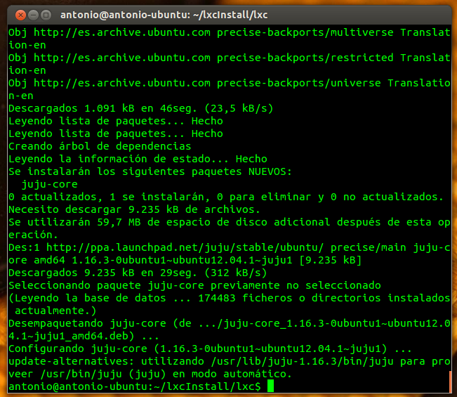
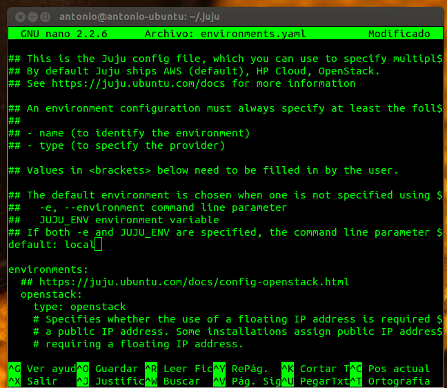
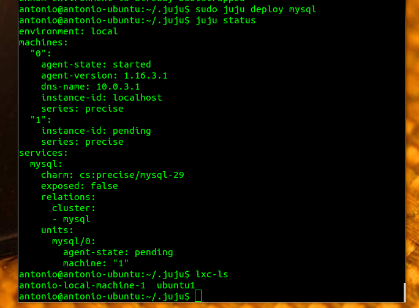
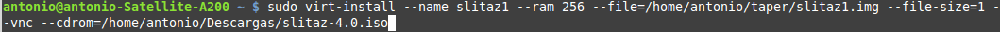
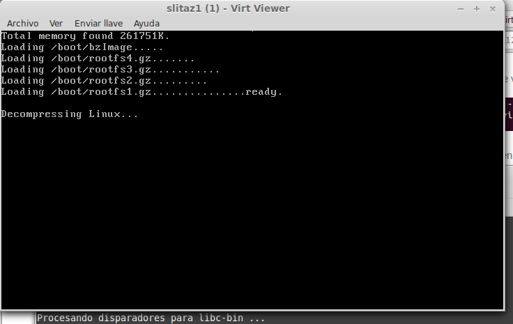
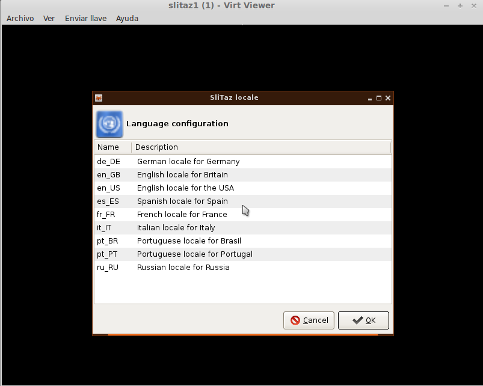
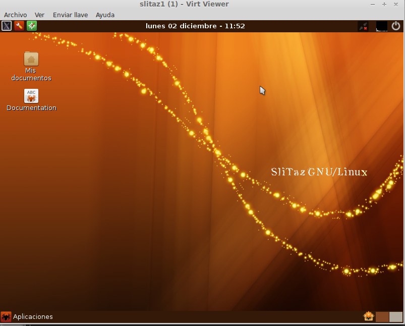

##Sesión 11/11

###Ejercicio 1)


### Ejercicio 2)

He instalado un contenedor Ubuntu mediante `sudo lxc-create -t ubuntu -n caja1`. Una vez ha terminado la instalación hay que arrancarlo con `sudo lxc-start caja1`, comprobamos que esté funcionando:


Y por último vemos los puentes de red activos `sudo brctl show`:


Como se observa se ha creado un puente de red hacia el contenedor llamado *lxcbr0*.

##Sesión 15/11

###Ejercicio 3)

**1.- Crear un contenedor basado en Debian**

Uso el mismo que el mostrado en el ejercicio anterior, le paso mi usuario para que lo reconozca `sudo lxc-start -n caja1`, los datos de acceso son los que usa lxc por defecto: Ubuntu - Ubuntu:


**2.- Instalar un contenedor de una distribución distinta a la tuya**

He intentado instalar un contenedor Fedora en mi Linux Mint pero me salían errores, he creado un issue al respecto.

He intentado la solución de José Colella, sustituyendo la plantilla de fedora por [ésta](https://raw.github.com/fajarnugraha/lxc/master/templates/lxc-fedora.in) pero el error persiste.

###Ejercicio 4)

**1.- Instalar lxc-webpanel y usarlo para arrancar, parar y visualizar las máquinas virtuales que se tengan instaladas.**

Los pasos para instalarlo son:

```sh
sudo su
sudo wget http://lxc-webpanel.github.io/tools/install.sh -O - | bash
```

Para tener más de un táper he clonado el que tenía: `sudo lxc-clone -o caja1 -n caja2`

Y comprobamos que se haya completado la instalación:


A continuación, si entramos en la IP local con el puerto 5000 y nos logeamos accedemos al panel de administración de los tápers:


**2.- Desde el panel restringir los recursos que pueden usar: CPU shares, CPUs que se pueden usar (en sistemas multinúcleo) o cantidad de memoria.**

Para modificar los recursos asignados a cada táper desde el panel web sólo hay que pinchar en su nombre y modificar los sliders correspondientes (**NOTA: el táper no puede estar corriendo**):


###Ejercicio 6)

**1.- Instalar juju**

El primer paso es añadir el respositorio e instalar juju:

```sh
sudo add-apt-repository ppa:juju/stable
sudo apt-get update && sudo apt-get install juju-core
```


Establecer *local* como sistema por defecto:



Y configurar el sistema para que funcione en local:
```sh
sudo apt-get install juju-local linux-image-generic-lts-raring linux-headers-generic-lts-raring
sudo apt-get install openssh-server
ssh-keygen
```

E instalar MongoDB mediante `sudo apt-get install mongodb-server`.

**2.- Usándolo, instalar MySql en un táper.**

Ejecutar `sudo juju deploy mysql`:



El problema es que despues de ejecutar la orden `expose` las máquinas siguen siempre en estado 'pending'.

###Ejercicio 7)

**1.- Destruir toda la configuración creada anteriormente.**

Sólo hay que ejecutar la orden `sudo juju destroy-environment`.

**2.- Volver a crear la máquina anterior y añadirle mediawiki y una relación entre ellos.**

Ejecutamos las órdenes:

```sh
sudo juju switch local
suju juju bootstrap

```

**3.- Crear un script en shell para reproducir la configuración usada en las máquinas que hagan falta.**

###Ejercicio 8)

El primer paso es comprobar que esté activada la aceleración por hardware mediante `kvm-ok`. A continuación hay que ejecutar:

```sh
sudo apt-get install kvm libvirt-bin
sudo adduser $USER libvirtd
```

###Ejercicio 9)

En primer lugar se instala virt-install, virt-manager y virt-viewer mediante 
```sh
sudo apt-get install virtinst
sudo apt-get install virt-manager
sudo apt-get install virt-viewer
``` 

Me he descargado la última versión de la distribución ligera [slitaz](http://www.slitaz.org/es/get/#stable). Para instalarla se siguen los siguientes pasos:

```sh
cd /home/antonio
mkdir taper
sudo virt-install --name slitaz1 --ram 256 --file=/home/antonio/taper/slitaz1.img --file-size=1 --vnc --cdrom=/home/antonio/Descargas/slitaz-4.0.iso
```



Una vez ejecutado eso aparece una ventana en la que se realiza la instalación normalmente:






