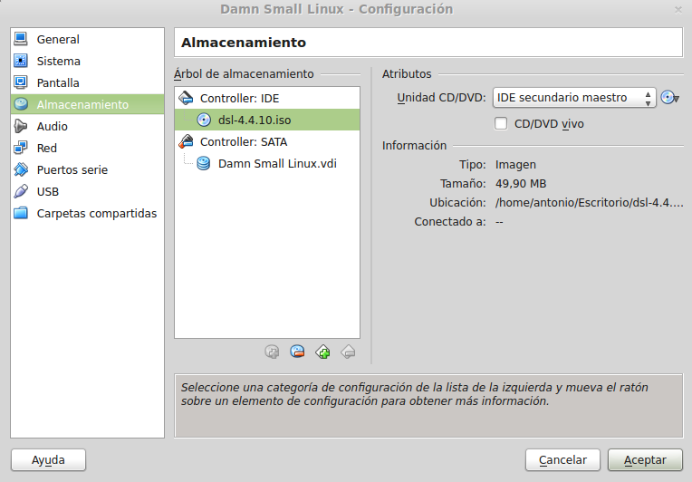

### Ejercicio 1)

Tal y como hicimos en el tema 1, para comprobar que podemos utilizar KVM hay que ejecutar la orden:


En mi caso lo dejé todo instalado así que puedo continuar sin usar paravirtualización.

### Ejercicio 2)

Voy a instalar con qemu una máquina virtual con Slitaz 4.0:

```sh
sudo modprobe kvm-intel
dd of=ficheroSlitaz.img bs=1k seek=100000 count=0
qemu-system-x86_64 -hda ficheroSlitaz.img -cdrom /home/antonio/Escritorio/slitaz-4.0.iso
```

Y entonces se inicia la máquina virtual:


Usando el hipervisor VirtualBox voy a instalar la última versión estable de la distribución Damn Small Linux, para ello hay que pulsar en Nueva, indicar un nombre para la MV:


Un tamaño de memoria RAM:


En este ejemplo voy a crear el disco duro virtual VDI desde el programa, aunque podría haber creado mediante el terminal un fichero qcow por ejemplo y asignarlo:


El siguiente paso permite establecer que el disco duro virtual sea disperso o tenga un tamaño fijo, yo he seleccionado que se reserve el espacio dinámicamente, comenzando con 500MB. Una vez hecho esto lo único que falta es seleccionar en las opciones de almacenamiento de la MV que arranque con la ISO de la distribución:



Y pulsar en *Iniciar* para arrancar la máquina virtual:


Al principio no funcionaba el ratón, pero tal y como encontré [aquí](https://forums.virtualbox.org/viewtopic.php?f=3&t=46880) es porque no funciona con la opción de integración de ratón, una vez que la desactivé todo funcionó correctamente.

Para instalarlo en el disco duro virtual hay que seguir [las instrucciones de la wiki](http://www.damnsmalllinux.org/wiki/installing_to_the_hard_disk_es.html).

### Ejercicio 3)


### Ejercicio 4)

En mi caso voy a instalar la distribución [Lubuntu 13.10](http://lubuntu.net/) en su versión de 32 bits. Para empezar hay que crear el almacenamiento virtual mediante `qemu-img create -f qcow2 ficheroLubuntu.qcow2 8G`. Después iniciamos la MV desde el CD de instalación y lo instalamos, como queremos que la MV tenga 512MB de memoria RAM lo indicamos con la opción correspondiente como se indica en el manual:


Mediante la orden `qemu-system-x86_64 -hda IV_imgs/ficheroLubuntu.qcow2 -cdrom /home/antonio/Escritorio/lubuntu-13.10-desktop-i386.iso -m 512 &` arrancamos la MV:


[establecer conexión SSH](http://www.bramschoenmakers.nl/en/node/100)

Continua....

### Ejercicio 5)

Para la realización de la práctica ha sido necesario realizar este ejercicio, se puede ver como lo he hecho [en la documentación de la misma.](https://github.com/antonioguirola/practica3IV#m%C3%A1quina-1-ubuntu-server-1204-lts-extra-peque%C3%B1o)

### Ejercicio 6)

El primer paso es instalar la GUI para juju:

```sh
sudo add-apt-repository ppa:juju/stable
sudo apt-get update && sudo apt-get install juju-core
sudo juju init
sudo juju switch local
sudo juju deploy juju-gui
```

Obligatorio usar Ubuntu, no funciona en Linux Mint. 

Continua...