### Ejercicio 1)

Para este ejercicio voy a usar la máquina virtual creada en Azure que ya utilicé en el tema anterior.

El primer paso es configurar la conexión SSH con la máquina anfitriona mediante `ssh-copy-id -i ~/.ssh/id_rsa.pub azureuser@iv-ubuntu-1310.cloudapp.net`. Una vez configurado accedemos a la MV e instalamos Chef:

```sh
ssh azureuser@iv-ubuntu-1310.cloudapp.net
sudo apt-get install ruby1.9.1 ruby1.9.1-dev rubygems
sudo gem install ohai chef
```

### Ejercicio 2)

Creamos la carpeta chef y generamos la configuración:

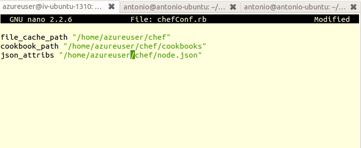

A continuación creamos dentro de la carpeta chef los directorios *cookbooks/ej2IV/recipes*, y en *recipes* el directorio *default.rb* con el contenido:

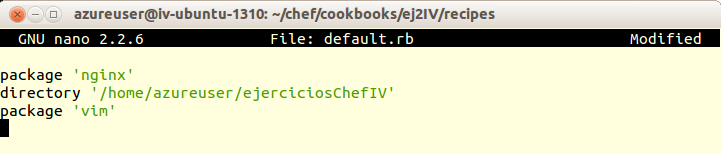

El objetivo es instalar los paquetes `nginx` y `vim` y crear el directorio *ejerciciosChefIV*. El siguiente paso es indicar en el fichero *node.json* qué recetas ejecutar, para ello lo editamos de la siguiente manera:

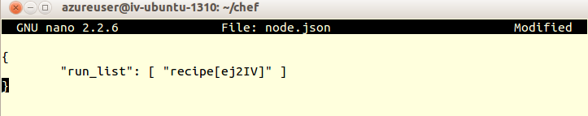


Una vez que todo está configurado lo ejecutamos mediante `sudo chef-solo -c chefConf.rb` y observamos que funcione:

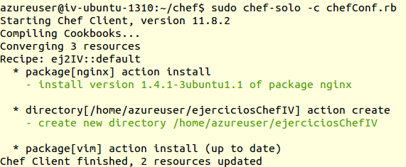


### Ejercicio 3)

En este ejercicio hay que pasar al lenguaje YAML la cadena 
```json
{ uno: &quot;dos&quot;, tres: [ 4, 5, &quot;Seis&quot;, { siete: 8, nueve: [ 10, 11 ] } ] }
```

O quitando las etiquetas HTML y formateándolo un poco:

```json
{ 	
	uno: "dos", 
	tres: [ 
			4, 
			5, 
			"Seis", 
			{ 
				siete: 8,
		  		nueve: [ 
		  				10, 
		  				11 
	  				   ] 
			} 
		  ] 
}
```
Siendo el equivalente en YAML:

```YAML
---
- uno: "dos"
  tres:
    - 4
    - 5
    - "Seis"
    -
      - siete: 8
        nueve: 
          - 10
          - 11
```


### Ejercicio 4

En primer lugar configuramos el servicio SSH para que no tengamos que introducir la contraseña cada vez que queramos conectarnos, para ello ejecutamos `ssh-copy-id -i ~/.ssh/id_rsa.pub azureuser@iv-ubuntu-1310.cloudapp.net`.

A continuación configuramos una lista con las máquinas que vamos a configurar remotamente, en mi caso sólo una por ahora, para ello creamos el archivo ansibleHosts con el contenido

```
[mvAzure]
http://iv-ubuntu-1310.cloudapp.net
```

Y un Playbook en el que indicamos que queremos descargar los ficheros fuente del repositorio del proyecto Cafeteros desarrollado en la última práctica de la asignatura:

```YAML
---
- hosts: mvAzure
  sudo: yes 
  tasks:
    ## DESCARGAR EL PROYECTO
    - git: repo=https://github.com/IV-GII/Cafeteros.git dest=/home/azureuser/Cafeteros/
```

Para ejecutarlo hacemos `ansible-playbook ej4Tema6Playbook.yml -i ansibleHosts -u azureuser`

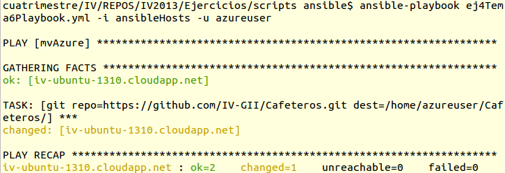

Y comprobamos en la MV que efectivamente se han descargado los ficheros:

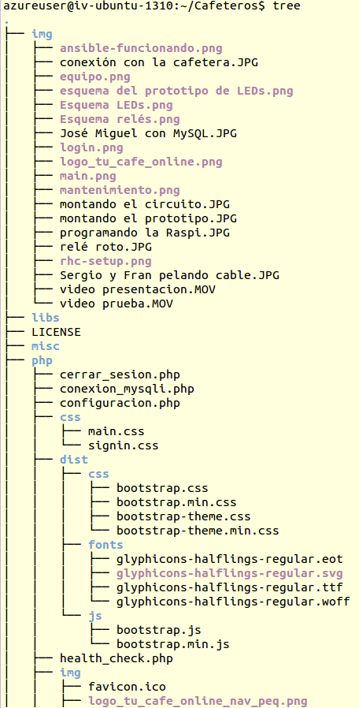


### Ejercicio 5

Este ejercicio ya se ha resuelto en la [fase de aprovisionamiento del proyecto Cafeteros que se ha mencionado antes](https://github.com/IV-GII/Cafeteros#aprovisionamiento), además ahí puede verse un ejemplo del Playbook en funcionamiento sobre una máquina similar a la que estoy utilizando para estos ejercicios.


### Ejercicio 6

Tras ejecutar `sudo apt-get install vagrant` para instalarlo he añadido la máquina con la descripción *Debian Squeeze amd64 (with Puppet, Chef and VirtualBox 4.2.1)* de la [lista](http://www.vagrantbox.es/) ejecutando `vagrant box add debian http://f.willianfernandes.com.br/vagrant-boxes/DebianSqueeze64.box`.

Vemos cómo empieza a descargar la imagen:

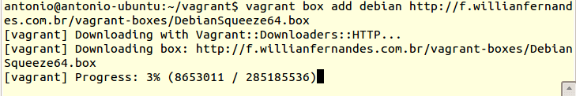

Una vez que acaba la descarga podemos ejecutamos `vagrant init debian`, lo cual creará el fichero de configuración Vagrantfile:

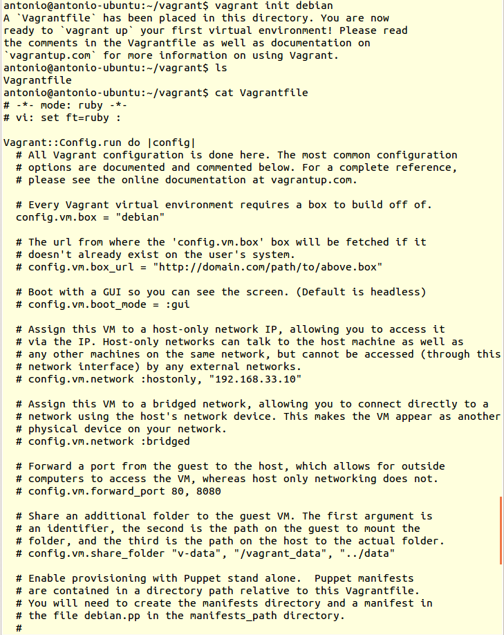

Si todo ha ido bien ya podemos levantar la MV y acceder mediante SSH:

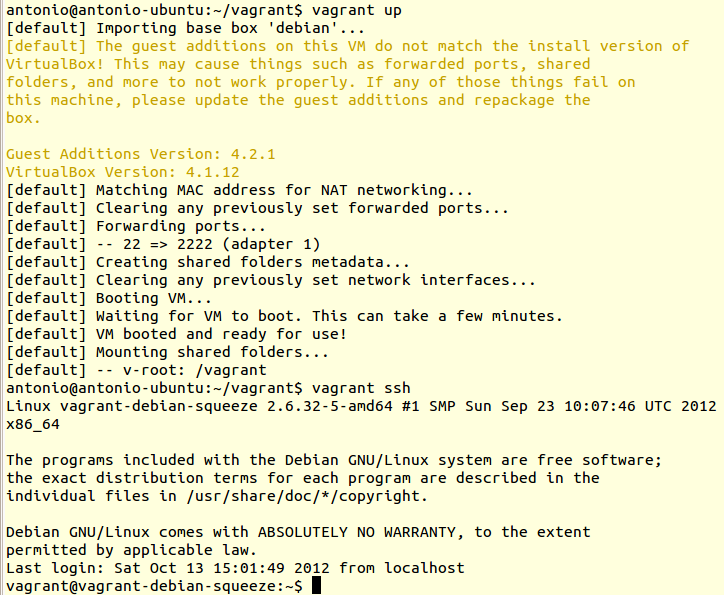


### Ejercicio 7

Para instalar el servidor web **nginx** el archivo Vagrantfile queda así:

```
# -*- mode: ruby -*-
# vi: set ft=ruby :

VAGRANTFILE_API_VERSION = "2"

Vagrant.configure(VAGRANTFILE_API_VERSION) do |config|
  config.vm.box = "debian"

    config.vm.provision "shell",
    inline: "sudo apt-get update && sudo apt-get install -y nginx"
end
```
Se va mostrando la información en pantalla durante la instalación:

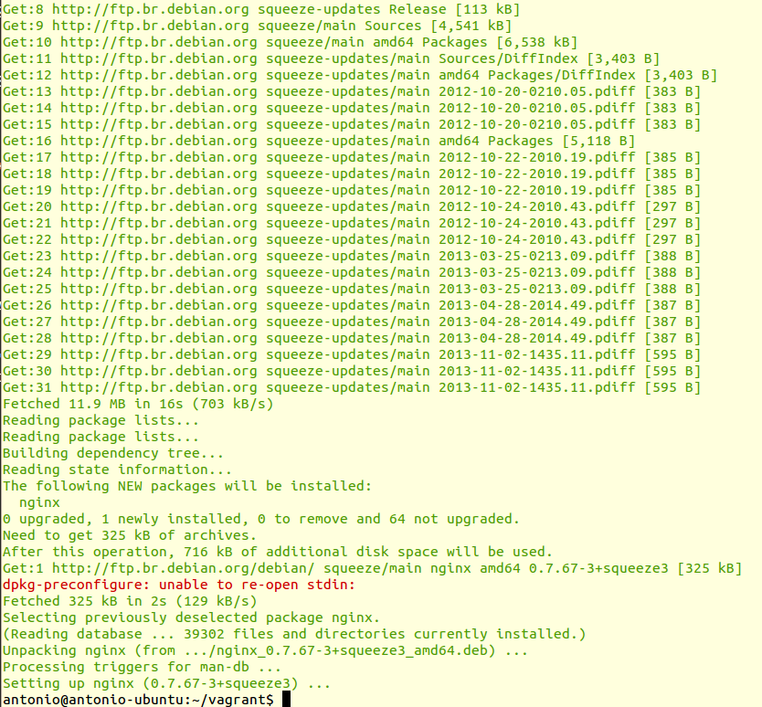

Para comprobar que está bien instalado accedemos a la MV mediante `vagrant ssh` e intentamos arrancar el servicio:

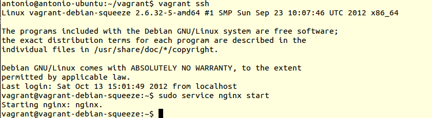


### Ejercicio 8

Tal y como se nos expone en la [documentación de vagrant](http://docs.vagrantup.com/v2/provisioning/ansible.html) el sistema es capaz de manejar automáticamente el inventario de sus máquinas virtuales, pero como nuestro compañero Germán [expone](https://github.com/germaaan/IV_GMM/blob/master/TEMA6/ejercicio08.md) este método no es muy fiable, es por ello que voy a indicar la ruta al inventario explícitamente. El archivo de host quedaría así:

```
[vagrant]
192.168.111.222
```

Como *Playbook* se utilizará una modificación de el utilizado en el ejercicio 4, descargando ficheros desde un repositorio público:

```YAML
---
- hosts: vagrant
  sudo: yes 
  tasks:
    ## DESCARGAR EL PROYECTO
    - git: repo=https://github.com/IV-GII/Cafeteros.git dest=/home/vagrant/Cafeteros/
```


En el *Vagrantfile* hay que fijar una IP para poder comunicarnos con la MV: `config.vm.network :private_network, ip: "192.168.111.222"` y decirle que queremos que ejecute el Playbook ya definido:

```
VAGRANTFILE_API_VERSION = "2"

Vagrant.configure("2") do |config|
  config.vm.box = "debian"
  config.vm.network :private_network, ip: "192.168.111.222"

  config.vm.provision "ansible" do |ansible|
    ansible.playbook = "vagrantPlaybook.yml"
  end

end
```

Una vez establecida toda la configuración no he podido relanzar la MV con la nueva dirección IP, me salía este mensaje:

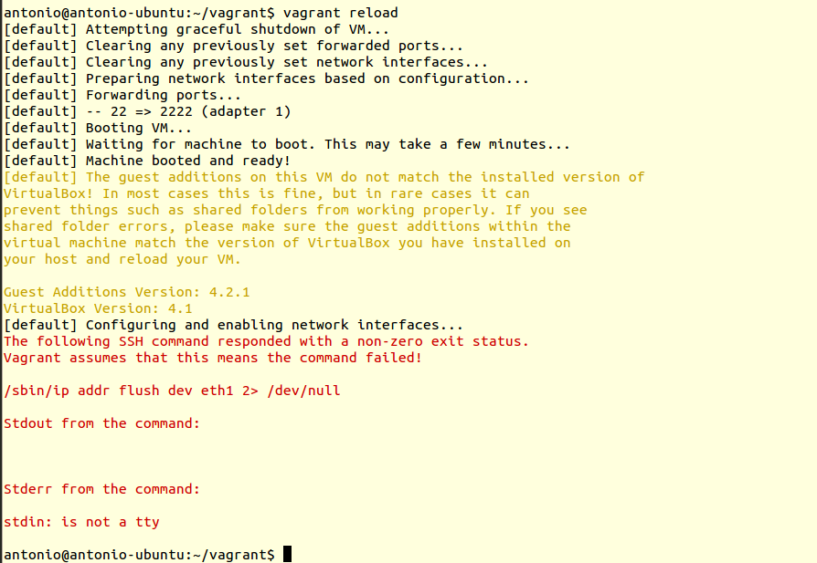

sin importar qué dirección le pusiera.
